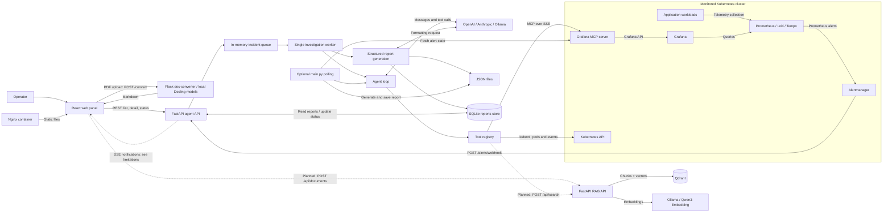
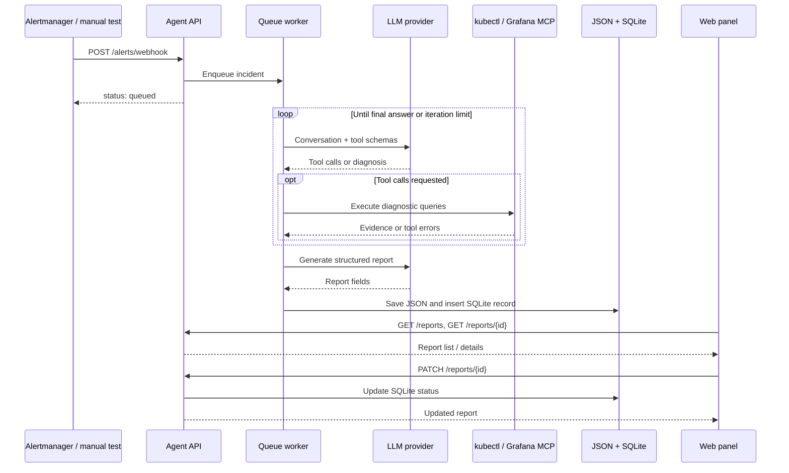

# Architecture and incident flow

This document describes the current implementation of IDAR: a system that
investigates cloud-native incidents and presents diagnostic reports to an operator.
The agent gathers evidence and recommends actions; it does not automatically
change the infrastructure.

For image builds and deployment configuration, see [CONTAINERS.md](CONTAINERS.md).
For manual and automated tests in PowerShell and Bash, see [TESTING.md](TESTING.md).
For the example monitoring stack, see the
[infrastructure README](../example-infrastructure/README.md).

## Components

| Component | Responsibility | Main files |
| --- | --- | --- |
| Web panel | React UI for incident lists, report details, status changes, and document preparation; served by Nginx in Docker | `client/src/pages/`, `client/src/lib/api.ts` |
| Document converter | Independent Flask service converting PDFs to Markdown with local Docling models | `doc-converter/doc_converter/` |
| RAG knowledge base | FastAPI service that ingests Markdown documentation (section-aware chunking + embeddings) into Qdrant and serves semantic search with provenance for the agents | `server/app/` |
| Agent API | FastAPI application receiving Alertmanager webhooks and serving reports | `agent-core/webhook_server.py` |
| Investigation worker | Processes an in-memory queue, one incident at a time | `agent-core/webhook_server.py` |
| Agent loop | Repeatedly asks an LLM for tool calls or a final diagnosis, subject to an iteration budget | `agent-core/agent_core/agent/loop.py` |
| Provider adapters | Common interface for OpenAI, Anthropic, and Ollama | `agent-core/agent_core/llm/`, `agent-core/agent_core/config.py` |
| Tool registry | Common interface for local kubectl tools and remote MCP tools | `agent-core/agent_core/tools/` |
| Grafana MCP server | Exposes diagnostic tools backed by Grafana and its data sources | `example-infrastructure/values/grafana-mcp-values.yaml` |
| Monitoring stack | Metrics, logs, traces, alert evaluation, and notifications | `example-infrastructure/values/`, `example-infrastructure/alerts/` |
| Report storage | JSON diagnosis files and a SQLite store used by the API | `agent-core/agent_core/report.py`, `agent-core/agent_core/reports_store.py` |
| Optional polling process | Checks Grafana alerts for changes and writes JSON reports | `agent-core/main.py` |

## Architecture diagram



The browser contacts the agent API and document converter directly. Nginx serves
static files; it is not an API proxy. The converter runs as a service separate from
the agent; Markdown and text uploads are handled in the browser without conversion.
The Grafana MCP server is a separate service, not a
process embedded in the agent image. Kubernetes information also has a separate
path: the agent invokes kubectl directly, independently of MCP. The RAG knowledge
base is a fourth service with its own storage (Qdrant) and embedding engine (Ollama);
today it is exercised through its own HTTP API, and the dashed edges are the planned
panel and agent integrations.

## Incident flow

1. Prometheus evaluates an alert rule and Alertmanager sends a grouped notification
   to `POST /alerts/webhook`. A manual test can submit the same payload shape.
2. The API checks `WEBHOOK_SHARED_SECRET` when configured. It builds an incident
   description from firing alerts and extracts metadata such as service and severity
   from labels. Payloads without an actionable firing alert return `ignored`.
3. The API enqueues the incident and immediately returns `{"status":"queued"}`.
   This confirms acceptance, not successful completion of the investigation.
4. A single worker creates a fresh conversation with the incident and system prompt.
   The provider receives the conversation and the registered tool schemas.
5. The LLM requests tools. The registry dispatches them to kubectl or Grafana MCP,
   and the results are appended to the conversation. The loop continues until a
   final response or the iteration limit defined by `AGENT_MAX_ITERATIONS`.
6. A separate report-generation step converts the free-text diagnosis into fields
   such as title, summary, problem, evidence sources, and remediation suggestions.
7. The webhook worker writes a JSON file and inserts a SQLite record with an ID,
   timestamp, service, severity, initial `pending` status, and rendered Markdown.
   These are separate writes, not one transaction across both storage formats.
8. The panel reads structured report fields through REST; Markdown is an export
   artifact used by **Copy Markdown**. TanStack Query manages the client cache.
   The operator can mark the report resolved or
   reopen it. This changes the SQLite status, not the monitored workload or the
   original JSON report.



### Webhook versus polling

The Docker image starts `webhook_server.py` by default. It provides the report API
and the queue worker used by the panel. It does not automatically start `main.py`.

`python main.py` runs a separate polling process. It checks alert signatures and
investigates when the firing set changes. `AGENT_RUN_ONCE=true` performs one
investigation, using a fallback question if no firing alerts are found.
Currently this path writes JSON files only: it does not insert SQLite records or
publish report events, so its reports do not automatically appear in the panel.
Running both processes may produce duplicate diagnoses; they do not share deduplication.

## Local deployment and configuration

The following addresses match the local Docker setup used in [the testing guide](TESTING.md).
Actual bindings can be checked with `docker ps`.

| Connection | Local address / setting |
| --- | --- |
| Browser to panel | `http://localhost:3000` maps to Nginx port `8080` |
| Browser to agent | `http://localhost:8090` maps to agent port `8080` |
| Browser to converter | `http://localhost:5001`; separate container or host process, independent of agent availability |
| Browser to RAG API | `http://localhost:8100` maps to RAG API port `8080` (`docker compose up -d --build` in `server/`) or a host process on the same port |
| RAG API to Qdrant | `IDAR_QDRANT_URL=http://qdrant:6333` on the compose network; `http://localhost:6333` for a host process |
| RAG API to Ollama | `IDAR_OLLAMA_URL=http://host.docker.internal:11434` (Ollama on the host) or `http://ollama:11434` with the `docker-compose.ollama.yml` overlay |
| Agent to MCP | `MCP_GRAFANA_URL=http://host.docker.internal:18000/sse` |
| Host to MCP Pod | kubectl forwards `127.0.0.1:18000` to Service `grafana-mcp:8000` |
| Agent to Kubernetes | Mounted kubeconfig locally; ServiceAccount inside Kubernetes |
| Persistent data | Volume mounted at `/data`; reports and SQLite under `/data/reports` |

`--env-file` injects backend configuration at container creation; `-e` overrides
individual settings. Editing the host `.env` and restarting an existing container
does not reload those injected values: recreate the container with the updated file.
The frontend's `VITE_AGENT_API_URL` and `VITE_CONVERTER_URL` are embedded at build time, so changing them requires
rebuilding the frontend image. See [CONTAINERS.md](CONTAINERS.md) for build and run commands.

The agent connects to MCP and discovers tools during startup. Start the monitoring
stack and MCP tunnel before the agent. For Docker Desktop, leave this running in
a separate PowerShell terminal:

```powershell
kubectl --context docker-desktop port-forward --address 127.0.0.1 -n observability svc/grafana-mcp 18000:8000
```

The MCP Helm configuration must include the local Host allowlist override described
in [CONTAINERS.md](CONTAINERS.md). Restart the tunnel if its target Pod is replaced.

## Current boundaries

The intended SSE feed currently has a route-ordering issue: `/reports/{report_id}`
is registered before `/reports/stream`. See the
[SSE test](TESTING.md#5-check-live-updates-separately) for the expected behavior
and workaround. General troubleshooting is in [TESTING.md](TESTING.md#troubleshooting).

The queue and SSE broadcaster are in process memory. Use one API worker and one
agent replica; queued or active investigations are not durable across restarts.
JSON reports and SQLite status are separate representations, not an audit log of
every intermediate tool call.

The RAG backend exists as the separate `server/` service: `POST /api/documents`
accepts the panel's `{data, autor, tresc}` payload, chunks and embeds it into Qdrant,
and `POST /api/search` returns the most relevant documentation fragments with their
provenance (document, section path, author, date, score). Both integrations are
still pending: the panel's **Send** logs the payload to the browser console instead
of calling `/api/documents`, and the agent's tool registry has no knowledge-base
tool yet, so investigations do not consult the documentation. The chat panel has
been removed; RAG-backed chat remains future work. PDF conversion uses the
local `doc-converter` service with Docling. Default conversion does not use an LLM
API or send documents to an external provider. Optional figure descriptions can use
a separately configured model endpoint. The Docker image contains the default models;
host-process installations must download them before offline use.
Markdown/text preparation can be tested without the converter. See the
[converter README](../doc-converter/README.md) for model setup and code-block limitations.

The current web build is intended for private access. Public deployment needs the
authentication/proxy work described in [CONTAINERS.md](CONTAINERS.md). Keep LLM keys,
registry tokens, and kubeconfig credentials out of images and version control.
