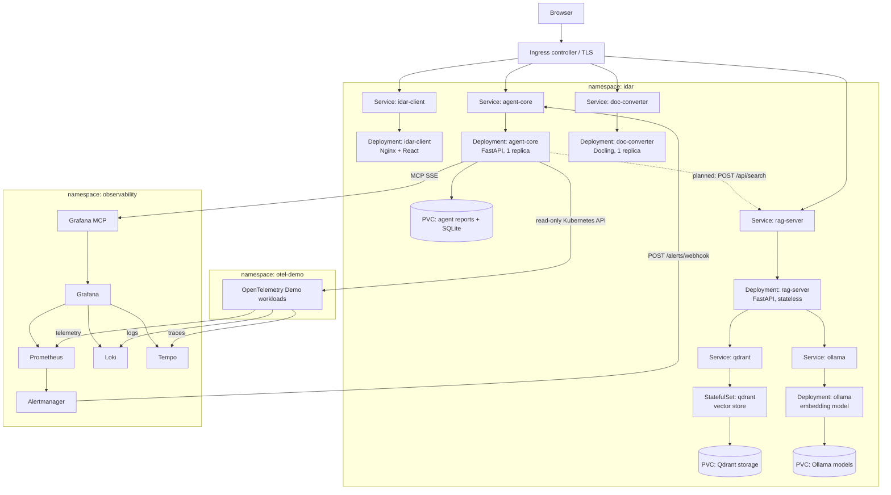

# Proposed Kubernetes cluster layout

This is the recommended target layout for the EC2-hosted Kubernetes cluster.
It separates application workloads by lifecycle and resource profile. A namespace
is a logical boundary; a node is a machine. Kubernetes schedules Pods from any
namespace onto nodes that satisfy their resource requests and placement rules.

## Logical layout



## Workloads and isolation

| Workload | Namespace | Recommended controller | Replicas | Storage | Main constraint |
| --- | --- | --- | --- | --- | --- |
| `idar-client` | `idar` | Deployment | 2 when ingress is used | none | lightweight and stateless |
| `agent-core` | `idar` | Deployment with `Recreate` | 1 | PVC mounted at `/data` | in-memory queue and local SQLite prevent horizontal scaling |
| `doc-converter` | `idar` | Deployment with `Recreate` | 1 initially | none when models are in the image | several GiB RAM per conversion; one worker/thread |
| `rag-server` | `idar` | Deployment | 1, can scale | none | stateless; waits for Qdrant and Ollama at startup |
| `qdrant` | `idar` | StatefulSet (official Helm chart) | 1 | PVC | vector store; pin the version used in `server/docker-compose.yml` (`v1.19.0`) |
| `ollama` | `idar` | Deployment with `Recreate` | 1 | PVC for model weights | embedding model; GPU node or a large CPU budget for `qwen3-embedding:8b` |
| Grafana MCP | `observability` | Deployment | 1 initially | none | read-only mode and authentication |
| Prometheus/Grafana/Loki/Tempo/Alertmanager | `observability` | chart-defined controllers | chart-specific | chart-specific PVCs | monitoring stack lifecycle |
| demo services | `otel-demo` | chart-defined Deployments/StatefulSets | scenario-specific | scenario-specific | diagnosed workloads |

Each row represents a separate Pod template. Do not combine `client`, `agent-core`,
`doc-converter`, and `rag-server` as sidecars in one Pod: they have different startup
times, resource needs, failure modes, and scaling rules. Qdrant and Ollama are
backing services of `rag-server` only; nothing else talks to them directly.

## Nodes and scheduling

Pods are not permanently assigned to a namespace-specific node. The scheduler may
place several Pods on one EC2 worker or spread them across workers. Start with a
general worker pool and define resource requests so scheduling remains predictable.

Suggested initial resources, to be validated with measurements:

| Container | CPU request / limit | Memory request / limit |
| --- | --- | --- |
| `idar-client` | `50m` / `250m` | `64Mi` / `256Mi` |
| `agent-core` | `100m` / `1` | `256Mi` / `1Gi` |
| `doc-converter` | `1` / `2` | `4Gi` / `6Gi` |
| `rag-server` | `100m` / `1` | `256Mi` / `1Gi` |
| `qdrant` | `250m` / `1` | `512Mi` / `2Gi` |
| `ollama` (`qwen3-embedding:8b`) | `2` / `4` | `8Gi` / `12Gi` |

The converter is the reason to keep spare memory on at least one worker. If regular
workers cannot provide it, add a larger worker and label it, for example
`workload=doc-conversion`, then apply a matching `nodeSelector` to the converter.
Add a taint/toleration only if that node should be reserved exclusively for it.
GPU scheduling is unnecessary for the converter's CPU pipeline. Ollama with the
`8b` embedding model is the one workload that benefits from a GPU node: on CPU it
works, but ingesting a large document takes minutes, while `0.6b` is comfortable on
CPU for development.

## Networking and public URLs

Use ClusterIP Services for traffic inside the cluster:

```text
agent-core.idar.svc.cluster.local:8080
doc-converter.idar.svc.cluster.local:5001
rag-server.idar.svc.cluster.local:8080
qdrant.idar.svc.cluster.local:6333
ollama.idar.svc.cluster.local:11434
grafana-mcp.observability.svc.cluster.local:8000
```

The browser cannot resolve Kubernetes Service DNS. Ingress must expose the panel,
agent API, and converter through public or private HTTPS URLs. A single host with
path routing is preferred:

```text
https://idar.example.com/             -> idar-client:8080
https://idar.example.com/api/         -> agent-core:8080
https://idar.example.com/converter/   -> doc-converter:5001
https://idar.example.com/rag/         -> rag-server:8080
```

Qdrant and Ollama stay ClusterIP-only: only `rag-server` calls them, and neither has
authentication of its own. The RAG API needs an Ingress route only once the panel
calls it from the browser; the agent reaches it through the in-cluster Service.
The current frontend expects service base URLs and does not automatically remove
Ingress path prefixes (the RAG API serves `/api/...` and `/healthz` at its root,
so the same caveat applies to `/rag/`). Either configure Ingress rewrite rules carefully or use
separate hosts such as `agent.idar.example.com` and `converter.idar.example.com`.
Build `client` with browser-reachable `VITE_AGENT_API_URL` and
`VITE_CONVERTER_URL`; in-cluster DNS names are incorrect for those values.

Disable proxy buffering for `/reports/stream` and keep its timeout above the SSE
keep-alive interval. Set `CLIENT_ALLOWED_ORIGINS` and converter `ALLOWED_ORIGINS`
to the panel's exact HTTPS origin.

## Storage and models

`agent-core` needs a ReadWriteOnce PVC at `/data` for JSON reports and SQLite.
Use one replica and the `Recreate` strategy so two Pods never mount and write the
same SQLite database concurrently. Back up this volume if reports must survive an
EC2 volume failure.

`qdrant` needs a ReadWriteOnce PVC for its collections. The RAG API keeps one
collection per embedding model behind the `kb_active` alias, so switching
`IDAR_EMBEDDING_MODEL` creates a new, empty collection and the documents must be
ingested again. `ollama` needs a PVC for model weights; pull the model with an init
container or a Job (`ollama pull qwen3-embedding:8b`) so that the API's readiness
probe can pass. `rag-server` itself has no volume.

`doc-converter` does not persist uploads or converted Markdown. Its Docker image
contains the default layout and table models, so it needs no PVC and can start with
model network access disabled. This increases image size but makes restarts
deterministic. OCR or code-enrichment models must also be built into a custom image
before enabling those options, or provided using a controlled read-only model volume.

## Security and configuration

- Put non-secret settings in ConfigMaps and credentials in Secrets. Do not bake API
  keys or tokens into images or `VITE_*` build arguments.
- Give `agent-core` a ServiceAccount with only `get`, `list`, and `watch` access to
  the required resources and namespaces. Keep `KUBECTL_ALLOWED_NAMESPACES` aligned
  with RBAC; the application allowlist is not a permission grant.
- Run Grafana MCP with write operations disabled and authenticate access to it.
- Run all IDAR containers as non-root (the RAG API runs as UID 10003) and use the
  read-only root filesystem where dependencies permit it. Give only `agent-core`
  a writable data volume; Qdrant and Ollama own their PVCs.
- `rag-server`: put `IDAR_API_TOKEN` in a Secret and `IDAR_CORS_ORIGINS` (the
  panel's exact origin) in the ConfigMap. Qdrant and Ollama have no authentication,
  so cover them with NetworkPolicies allowing ingress from `rag-server` only.
- Protect the public routes with TLS and an authentication proxy. Frontend build
  variables are visible to every browser and cannot safely carry long-lived tokens.
- Add NetworkPolicies after confirming the cluster network plugin enforces them:
  client ingress from the Ingress controller, agent access to MCP/Kubernetes/LLM,
  and converter ingress from the Ingress controller with only required egress.

## Probes and startup behavior

- `client`: HTTP liveness/readiness on `/healthz`, short startup allowance.
- `agent-core`: `/healthz` for liveness/readiness and a startupProbe long enough for
  MCP connection and tool discovery. The endpoint does not verify all dependencies.
- `doc-converter`: `/healthz` with a startupProbe of at least three minutes because
  loading models is CPU and disk intensive. Use a longer allowance on slower nodes.
- `rag-server`: liveness on `/healthz`, readiness on `/api/health` (checks Qdrant and
  runs an embedding probe; 503 when degraded), startupProbe of about 90 seconds so
  the first embedding call can load the model. `qdrant`: HTTP `/healthz` on 6333.
  `ollama`: `GET /api/version` on 11434.

Kubernetes ignores Dockerfile `HEALTHCHECK`, so these probes must be repeated in the
Deployment manifests. Alertmanager should call the agent Service directly inside the
cluster, while user-facing browser traffic should pass through Ingress.
